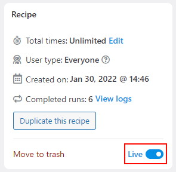

# espoir-ric-webhook

A web hook developped for the Wordpress of Espoir RIC project : [espoir-ric.fr](https://www.espoir-ric.fr/)

## Requirements

- Wordpress version 5.9 : [github.com/WordPress/WordPress](https://github.com/WordPress/WordPress)
- Contact Form 7 version 5.5.3 : [fr.wordpress.org/plugins/contact-form-7](https://fr.wordpress.org/plugins/contact-form-7/)
- Uncanny Automator version 3.6 : [wordpress.org/plugins/uncanny-automator](https://wordpress.org/plugins/uncanny-automator/)
- PHP 7.4
- A Google drive account

## Setup

- Create a form with Contact Form 7
- Add the custom.css content via `Appearance -> Customize` of your dashboard
- Add the form shortcode in one of your page
- Clone this project in your `wp-content/plugins/` folder
- Create a new recipes via `Automator > Add new` like this :

- Set it alive :

